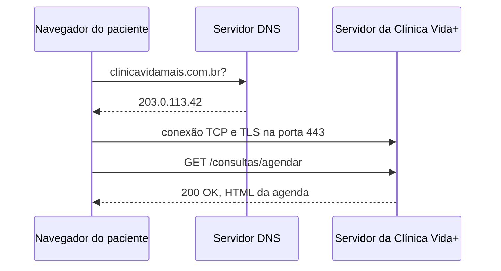

## O caminho de uma requisição

## Evidência do DNS

nslookup github.com

Resultado obtido:

Servidor: dns.google
Address: 2001:4860:4860::8888

Não é resposta autoritativa:
Nome: github.com
Address: 4.228.31.150

O DNS resolveu o domínio github.com para o endereço IP 4.228.31.150.

O resultado foi confirmado pelo comando ping github.com, que também utilizou o IP 4.228.31.150.

## Evidência do HTTP

| Requisição | Status | Tipo |
|---|---:|---|
| 65610.a20924495ad66810.module.css | 200 | stylesheet |
| 52684-230a1c6db561aa21.js | 200 | script |
| https://api.github.com/_private/browser/stats | 200 | ping |
| https://collector.github.com/github/collect | 204 | ping |

## Por que o HTTPS é necessário?

O formulário de agendamento da Clínica Vida+ precisa utilizar HTTPS para proteger os dados enviados entre o paciente e o servidor. Isso ajuda a impedir que terceiros interceptem ou alterem as informações durante a comunicação. Um dado sensível que o formulário pode carregar é o CPF do paciente. Além disso, informações como nome, telefone e dados do agendamento também precisam ser protegidos.
