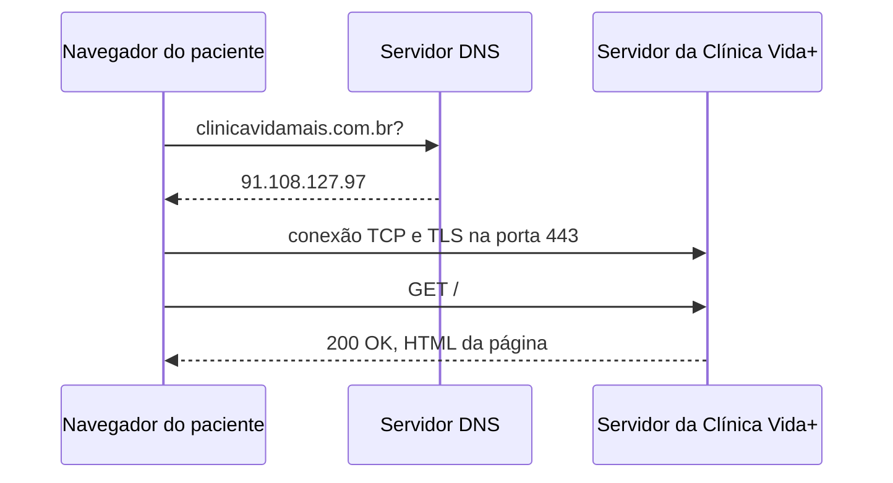

## O caminho de uma requisição

## Evidência do DNS

nslookup clinicavidamais.com.br 

Resultado obtido:

Servidor: dns.google
Address: 2001:4860:4860::8888

Não é resposta autoritativa:
Nome: clinicavidamais.com.br
Address:2a02:4780:17:ad2b:26e6:1d11:327a:ff35
2a02:4780:2e:b0d2:dff6:60df:2c9d:be72
91.108.127.97
89.116.213.183

O DNS resolveu o domínio clinicavidamais.com.br para o endereço IP encontrados no comando nslookup.

Entre os endereços IPv4 retornados estão 91.108.127.97 e 89.116.213.183.

## Evidência do HTTP

| Requisição | Status | Tipo |
|---|---:|---|
| https://clinicavidamais.com.br | 200 | text/html |
| https://clinicavidamais.com.br/consultas |agendar | 404 | text/html |

## Por que o HTTPS é necessário?

O formulário de agendamento da Clínica Vida+ precisa utilizar HTTPS para proteger os dados enviados entre o paciente e o servidor. Isso ajuda a impedir que terceiros interceptem ou alterem as informações durante a comunicação. Um dado sensível que o formulário pode carregar é o CPF do paciente. Além disso, informações como nome, telefone e dados do agendamento também precisam ser protegidos.
